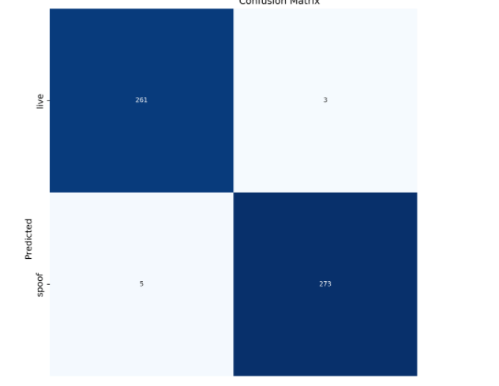

# Anti-Spoofing

## Eleccion de los modelos

Antes de elegir el modelo de yolo, se hizo una busqueda al respecto de cuales son los mejores modelos para la deteccion deimagenes, se realizaron comparaciones entre Yolo y VGG. Pero se concluyo que Yolo era mejor para el contexto necesario debido a que VGG es mucho mas pesado tanto eficientemente como en tiempo de ejecucion. Por otro lado se analizaron otras librerias de deep-learning como TensorFlwo y PyTorch, pero se concluyo que Yolo era la mejor opcion para el proyecto.

### Yolo

Yolo es un modelo de deep-learning que tiene caracteristica sque lo destacan de los demas, como por ejemplo el ReLu, que permite que el modelo obtenga una mejor precision en la deteccion de objetos. Tiene dimensiones de entrada mas grandes, esto con el fin de poder pasar imagenes con mayor calidad, para que el algoritmo pueda detectarlas de mejor manera.

Primero se analisis de la problematica con el fin de indentificar cual modelo era el mas adecuado, por lo tanto se llego a la conclusion de que se va a utilizar el modelo clasificador(Classifier) de Yolo.

### Creacion del Dataset

Primero se les pidio ayuda a conocidos y a personas dispuestas a realizar un video de alrededor de 1 minuto, perfilando la cara por la mayoria de angulos posibles, tambien realizando distintos tipos de expresiones. Esto con el fin de tener un grupo de imagenes para el dataset. Por otro lado se buscaron imagenes en internet y luego con esas imagenes obtenidas se procesaron con el fin de obtener las imagenes con un estilo de spoofing. Esto se realizo con distintos tipos de camaras y distintos tipos de paneles en las pantallas para que luego cuando se creara el dataset el modelo tuviera distintos tipos de imagenes con diferentes contextos para analizar.

El dataset obtenido cuenta con 6000 imagenes, clasificadas en 80% (4800 imagenes aprox), 10% (600 imagenes aprox), 10% (600 imagenes aprox).

### Entrenamiento

El entrenamiento se realizo en python, con la libreria de Ultralytics, luego se entreno el modelo por primera vez se entreno con 50 epochs, luego 100 epochs y por ultimo 130 epochs, pero se concluyo que al entrenar tanto el modelo pierde su consistencia y credibilidad. Por lo tanto se dejo con 100 epochs. 

Se eligio el modelo M(Medium), debido a su tamaño, eficiencia y credibilidad, ya que con el modelo XL, el modelo no servía de la manera correcta y daba analisis erroneos.

Una vez se eligió el modelo, se comenzó con el entrenamiento

```py
# Comando para comenzar el entrenamiento

# imgsz = Image size of the input
# batch = Indicates how many images are processed before the model's internal parameters are updated. \
# weight_decay = Penalizing large weights to prevent overfitting.
model.train(data=dataset, epochs=100, imgsz=244, batch=16, weight_decay=0.0005)
```
Luego se utilizó el ```model.val```, con el fin de que el modelo use un 10% de los datos para cambiar hiperparametros y mejorar el modelo.



### Implementación


