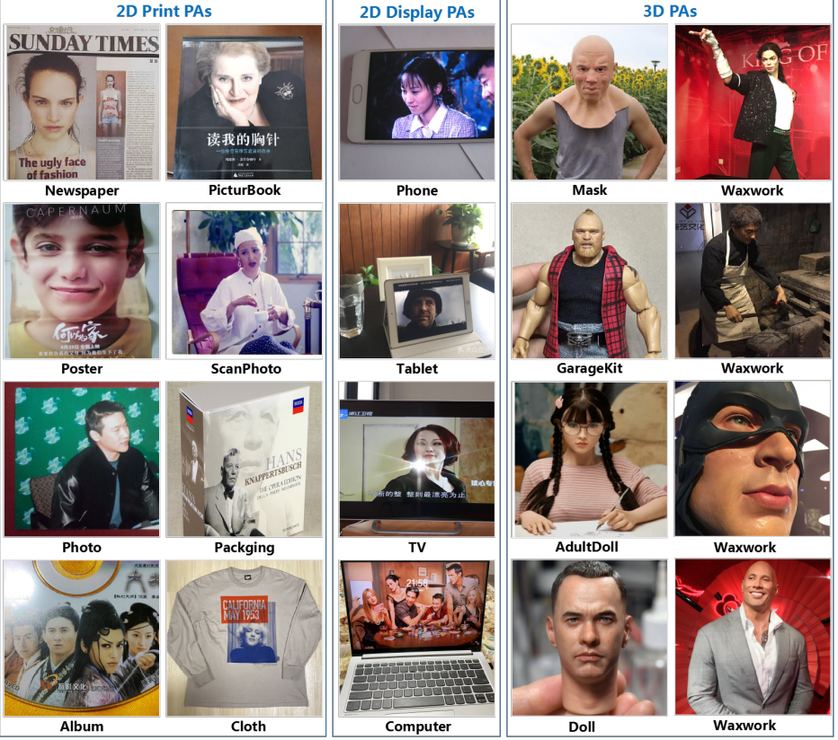

Los problemas del FAS(Face Anti Spoofing), pueden clasificarse en varios problemas, por ejemplo,
clasificación y supervisión, Supervisión auxiliar de píxeles y por ultimo
supervisión generativa a nivel de pixeles.

## Methods

### Clasificación Supervision

1. Suelen utilizar metodos como la supervisión de entropía cruzada binaria (Binary cross-entropy)

### Supervisión generativa a nivel de pixeles

Este modelo se entrena y realiza la inferencia de manera integralpor toda la red en etapas intermedias.
Con esto me refiero a que la etapa de aprendizaje y la de inferencia
(evaluación o predicción) se realizan de manera conjunta y continua.
Esto se debe a que en la mayoria de entrenamientos de deep leaning se utiliza
un dataset para el entrenamineto y luego de entrenarla se pueden usar
inferencias sin la necesidad de etapas adicionales como otros modelos que si lo
necesitan.

Este modelo menciona la adaptación de sistemas de reconocimiento facial, con un
uso de recursos eficientes con el fin de poderse utilziar en dispotisitivos
movbiles y plataformas con bajos recursos computacionales.

1. Se utiliza el MobileNetV2, que es una arquitectura de red neuronal convolucional (CNN), con el fin de ser eficiente y liviana.
1. Utiliza un FNC poco profunda, esto indica que tiene menos capas en comparación con otras arquitecturas.

Utiliza una pérdida focal binaria, la cual ayuda a mejorar la prediccón de
muestras dificiles. Esto ayuda a ampliar el margen entre las muestras
live(reales) y spoof(falsas).

1. Posee operaciones pixel-wise las cuales se aplican individualmente a cada pixel para analizarlo mediante la intensidad, color, información

Metodos como los SIFT( Transformaciones de caracteristicas invariantes a escala), 

## The Viola-Jones cascade Detection

Este algoritmo se encarga de utilizar regiones de una imagen para describirlas, utiliza el Boosting para 

### Desventaja
Es propenso al sobreajuste, ya que el modelo se ajusta demasiado a los detalles especificos de los datos y como resultado tiene un rendimiento deficiente al enfrentarse a nuevos datos no vistos.

Referencia: [URL](https://arxiv.org/pdf/2304.05753v3.pdf)

URL de la pagina: [URL](https://paperswithcode.com/paper/wild-face-anti-spoofing-challenge-2023)

Repositorio con posible utilizacion de FAS: [URL](https://github.com/Prem95/realtime-face-anti-spoofing)

### Datasets
Moiré patterns

ROSE-Youtu Dataset
NUAA dataset

MTCNN [32] and RetinaFace 

Viola-Jones
cascade detector

