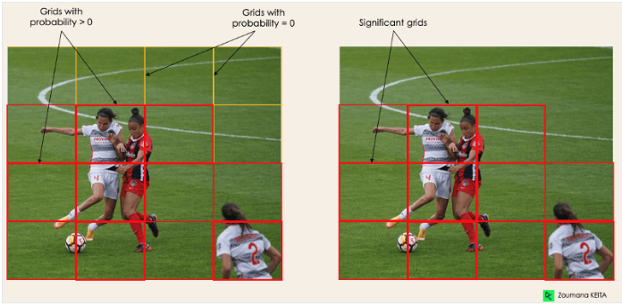

# Best algorithms for image recognition

[Link to the article](https://viso.ai/computer-vision/image-recognition/)

Image recognition is an application of computer vision
that requieres more than one computer task, such as
object detection and image classification.

Image Detection is the task of taking an image as input
and finding various objects within it. An example is
face detection, where algorithms aim to find face
patterns in images

- Yolo
- VGG

# Yolo

[Yolo article](https://www.datacamp.com/blog/yolo-object-detection-explained)

Yolo (You only look once) is a real-time object detection algorithm, it uses a CNN. 

Keras is a framework written in python that is designed to experiment with Neural network models.

- Process the image with keras

Pipelines are series of data processing steps that are chained together to streamline in the workflow.
They are steps to process data and simplify the workflow

Features:
    - Speed
    - Accuracy
    - Open Source

Process images at 45 FPS

High detection Accuracy

Better generalization

## Architecture

- Redimenciona la entrada de las imagenes a 448x448 (Input Resizing), esto se hace con el
  finde estandarizar el tamaño de entrada de la red neuronal. La resolución
  actual de Yolo ha mejorado considerablemente, debido a que la mayoria de
  modelos utilizan una resolución de 224x224, lo que hace que rinda mejor el
  modelo.

- Convolution 1x1: Esto ayuda a reducir la dimensionalidad de los canales, con
  el fin de disminuir la complejidad computacional, permitiendo que sea más
  eficiente.

- Convolution 3x3: Después de la 1x1 se aplica esta otra para extraer
  características más complejas de la imagen. Con el fin de generar un volumen
  de salida que tenga lo más importante y detallado de la imagen.

- ReLu(Rectified Linear Unit): Esto es una función de activación utilizada en
  redes neuronales, esto devuelve cero para valores negativos y el mismo valor
  para valores positivos. Esto sirve para que las redes neuronales aprendan
  patrones más complejos y trae varios beneficios adicionales, como lo son los
  siguientes:
  - Facilita el entrenamiento
  - Eficiencia computacional
  - Mayor velocidad de convergencia:
    - Gracias a la simplicidad y la eliminación de la saturación de entradas positivas

## ¿How does Yolo Work?
The algorithm use several aproaches:

1. Residual Blocks:
    1. Are a component of a deep neural network that aims to address the
      vanishing gradient problem, this problem is very common on high layer
      Architectures, that has a lot of layers on the images. 
1. Bounding Box Regression: 
    1. This refines the coordinates of the Bounding boxes predicted by the model.
1. Intersection Over Union (IOU): It keeps the relevant information, and obviously discard the irrelevant boxes.
1. Non-Maximun Supression (NMS): NMS to keep only the boxes with the highest probability score of detection. 

{ width=300px }

### Aplications of Yolo

1. Agriculture
1. Security Surveillance
1. Self Driving Cars

## VGG

VGG hace referencia a un grupo de geometria visual, Visual Geometry Group

The numbers we see in this kind of models at the end, for example the VGG-16 or
the VGG-19 stands for the deep layers of the model.

### Disadvantages
It is really heavy so it takes time to train its parameters
It weights arround 533MB, so implementing it takes a time-consuming task

It has a 6,7% error, and wons a GoogleNet classification.

[VGG Article](https://viso.ai/deep-learning/vgg-very-deep-convolutional-networks/)
